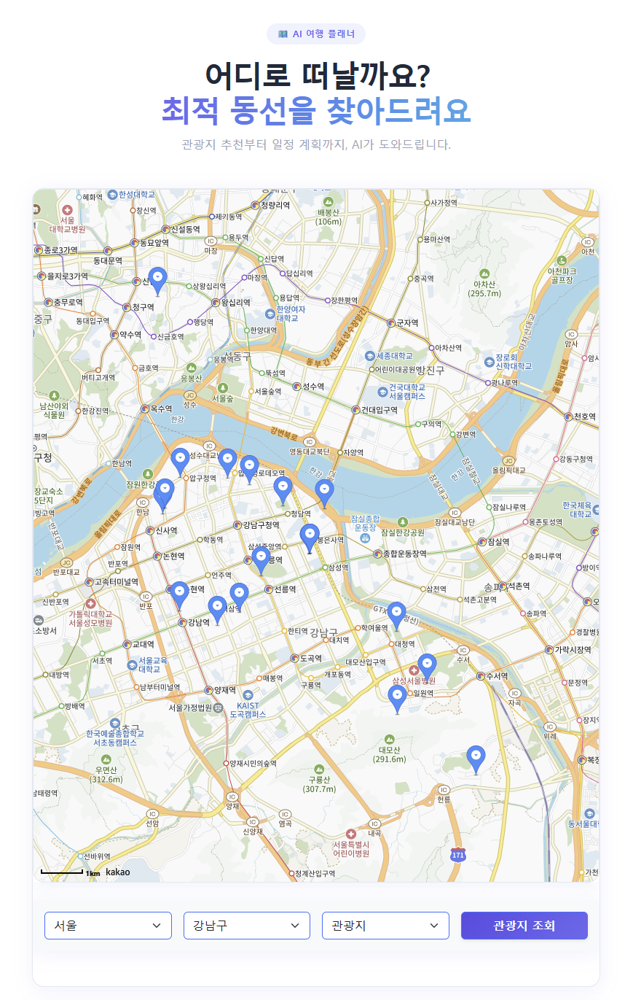
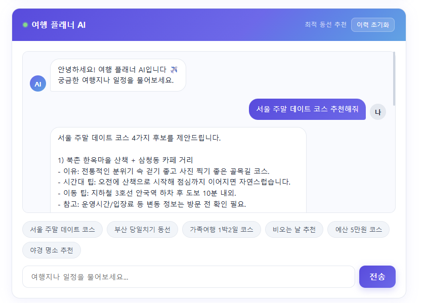

# 관광지 추천 챗봇 — 서울 10반 팀프로젝트

생성형 AI와 RAG(Retrieval-Augmented Generation)를 활용한 관광지 추천 챗봇 프로젝트입니다.  
사용자는 웹 화면에서 질문을 입력하고, 챗봇은 문서 벡터 검색 결과와 Claude를 결합해 맞춤 여행 정보를 제공합니다.

---

## 0. 접속 URL

| 환경 | URL |
|------|-----|
| 서비스 (k8s) | http://44.203.66.174 |
| Jenkins CI/CD | http://54.172.210.38:8080 |

---

## 1. 프로젝트 개요

| 항목 | 내용 |
|------|------|
| 프로젝트명 | 관광지 추천 챗봇 |
| 개발 기간 | 2026.05 ~ 2026.06 |
| 개발 인원 | 3인 팀 프로젝트 (방지섭·이경호·이유정) |
| 핵심 기술 | RAG, Vector DB, Spring Boot, Vue.js 3, FastAPI |
| 인프라 | Docker, Kubernetes(k3s), AWS(EC2·RDS·ECR), Jenkins CI/CD |

### 주요 기능
- 채팅형 UI에서 관광지·여행 코스 질문/응답
- RAG 기반 문서 검색 + Claude Sonnet 응답 생성
- 빠른 질문 버튼 6개로 주요 시나리오 즉시 실행
- 회원가입/로그인/JWT 인증
- Kakao Map 연동으로 관광지 위치 확인
- 채팅 이력 저장 및 조회

---

## CI/CD 인프라

### 전체 파이프라인 흐름

```
개발자 로컬
    │ git push
    ▼
GitHub (HaruRoute/artifact, frontend, backend, ai_server)
    │ Webhook
    ▼
Jenkins EC2 (54.172.210.38:8080)
    │ 1. Checkout   - 소스 repos pull
    │ 2. Inject Secrets - 시크릿 파일 주입 (Jenkins Credentials)
    │ 3. Build      - Docker 이미지 빌드 (docker compose build)
    │ 4. Push to ECR - ECR에 :빌드번호 + :latest 태그로 push
    │ 5. Deploy to k3s - SSH → k3s EC2에 kubectl apply + rollout restart
    │ 6. Health Check  - 프론트/백엔드 HTTP 상태 확인
    ▼
Amazon ECR (969658552435.dkr.ecr.us-east-1.amazonaws.com/haruroute/)
    │ haruroute/frontend:latest
    │ haruroute/backend:latest
    │ haruroute/ai-server:latest
    ▼
k3s EC2 (44.203.66.174) - Kubernetes 클러스터
    ├── frontend  Pod  → nginx (port 80)
    ├── backend   Pod  → Spring Boot (port 8080) → RDS MySQL
    └── ai-server Pod  → FastAPI (port 8000)
         ↑
    Traefik Ingress (/ → frontend, /api → backend)
         ↑
    외부 접속: http://44.203.66.174
```

### AWS 인프라 구성

| 구성요소 | 사양 | 역할 |
|---------|------|------|
| Jenkins EC2 | t2.small (us-east-1) | CI/CD 서버 (Docker 빌드 + ECR push) |
| k3s EC2 | t2.medium (us-east-1) | Kubernetes 클러스터 (서비스 실행) |
| Amazon ECR | us-east-1 | Docker 이미지 레지스트리 |
| Amazon RDS | db.t4g.micro MySQL 8.0 | 관리형 DB (백엔드 전용) |

### 시크릿 관리 전략

- DB 비밀번호, JWT Secret, API Key 등 민감 정보는 **Git에 저장하지 않음**
- Jenkins Credentials에 시크릿 파일로 등록 (`haruroute-env`, `haruroute-secret-yml` 등)
- k8s Secret(`haruroute-secret`)은 `kubectl create secret` 명령으로 직접 생성 (YAML 파일 저장 금지)
- ECR 인증은 각 EC2의 IAM Role로 처리 — Jenkins EC2는 push 권한(`AmazonEC2ContainerRegistryFullAccess`), k3s EC2는 pull 권한(`AmazonEC2ContainerRegistryReadOnly`)으로 최소 권한 적용

### k8s 매니페스트 (`k8s/`)

| 파일 | 내용 |
|------|------|
| `backend-deployment.yaml` | Spring Boot Deployment + Service, RDS 연결 env 포함 |
| `frontend-deployment.yaml` | nginx Deployment + NodePort Service |
| `ai-server-deployment.yaml` | FastAPI Deployment + Service |
| `ingress.yaml` | Traefik Ingress (/ → frontend, /api → backend) |

### GitHub Webhook 설정

GitHub push → Jenkins 자동 빌드 트리거 연동:

| 항목 | 값 |
|------|-----|
| Payload URL | `http://<Jenkins_IP>:8080/github-webhook/` |
| Content type | `application/json` |
| Events | push 이벤트만 |

`Jenkinsfile`에 `triggers { githubPush() }` 선언으로 Webhook 수신 시 파이프라인 자동 실행.

### Jenkins 주요 설정

- **Credentials 등록 필요**
  - `haruroute-env` (Secret file) - 루트 `.env`
  - `haruroute-frontend-env` (Secret file) - `frontend/.env`
  - `haruroute-secret-yml` (Secret file) - `application-secret.yml`
  - `haruroute-ai-env` (Secret file) - `ai_server/.env`
  - `k3s-ssh-key` (SSH Username with private key) - k3s EC2 접속 키
- **IAM Role** - Jenkins EC2에 `AmazonEC2ContainerRegistryFullAccess`(push), k3s EC2에 `AmazonEC2ContainerRegistryReadOnly`(pull) 정책 포함 Role 부여

---

## 📅 주요 업데이트 및 개선 사항

### 14) 2026-06-25: CI/CD + k8s 인프라 구축 (최신)

* **CI/CD 파이프라인 구축 (Jenkins + Amazon ECR + k3s)**:
  - GitHub push → Jenkins Webhook → Docker 빌드 → ECR push → k3s 자동 배포까지 완전 자동화된 파이프라인을 구성했습니다.
  - `Jenkinsfile`의 `Push to ECR` 스테이지: `aws ecr get-login-password`로 ECR 인증 후 `:빌드번호` + `:latest` 이중 태그로 push하여 버전 롤백이 가능하도록 했습니다.
  - `Deploy to k3s` 스테이지: Jenkins에서 k3s EC2로 SSH 접속 후 `kubectl apply` + `kubectl rollout restart`로 무중단 업데이트를 구현했습니다.

* **Amazon ECR 도입**:
  - Docker Hub 대신 AWS ECR을 이미지 레지스트리로 사용하여 VPC 내 private 통신과 IAM 기반 접근 제어를 적용했습니다.
  - k3s EC2의 `/etc/rancher/k3s/registries.yaml`에 ECR 인증을 등록하여 이미지 pull 시 자동 인증합니다.

* **k3s Kubernetes 클러스터 구성**:
  - t2.medium EC2에 k3s(경량 Kubernetes)를 설치하여 4개 서비스(frontend, backend, ai-server + Traefik Ingress)를 운영합니다.
  - Traefik Ingress로 단일 IP(`44.203.66.174`)에서 경로 기반 라우팅(`/` → frontend, `/api` → backend)을 구현했습니다.

* **Amazon RDS MySQL 전환**:
  - Docker Compose의 MySQL 컨테이너를 Amazon RDS(db.t4g.micro, MySQL 8.0)로 교체하여 백업/패치/고가용성을 AWS가 관리하도록 했습니다.
  - Spring Boot Flyway가 RDS 연결 후 자동으로 마이그레이션 및 초기 데이터 삽입을 수행합니다.

* **k8s 시크릿 분리**:
  - `kubectl create secret generic haruroute-secret`으로 민감 정보를 직접 주입하여 Git 저장소에 credentials가 노출되지 않도록 했습니다.

### 13) 2026-06-25: Docker Compose 환경 구성, TutorialTour 버그 수정, UI 개선

* **인프라 — Docker Compose 4컨테이너 환경 구성**:
  - `frontend`(nginx), `backend`(Spring Boot), `ai_server`(FastAPI), `mysql` 4개 컨테이너를 `docker-compose.yml` 단일 파일로 관리합니다.
  - nginx 리버스 프록시(`/api/` → `backend:8080`)를 통해 CORS 문제를 해결했습니다. 프론트엔드 빌드 시 `VITE_API_URL=/api`로 환경변수를 주입하여 모든 API 요청이 상대경로로 nginx를 경유합니다.
  - MySQL 포트를 `3307:3306`으로 매핑하여 로컬 MySQL과 충돌을 방지했습니다.

* **Backend — Spring Boot 4.0 Flyway 수동 설정 (`FlywayConfig.java`)**:
  - Spring Boot 4.0에서 `FlywayAutoConfiguration`이 제거된 변경사항에 대응하여 `@Bean`으로 Flyway를 수동 등록했습니다.
  - `ApplicationRunner` 실행 전 ApplicationContext 초기화 단계에서 마이그레이션이 완료되어 `DataInitializer`와의 실행 순서 문제를 방지합니다.
  - `application.yml`의 `baseline-on-migrate: false`로 변경하여 최초 실행 시 V1 스킵 문제를 해결했습니다.

* **Frontend — TutorialTour 다크 스크린 버그 수정 (`TutorialTour.vue`)**:
  - 최초 로그인 시 투어 스포트라이트가 참조하는 DOM 요소(`tour-chat-btn` 등)가 없을 경우 `box-shadow: 0 0 0 9999px` 오버레이가 전체 화면을 덮는 버그를 수정했습니다.
  - `updatePosition()`에서 요소가 없으면 spotlight를 `display:none`으로 숨기고 tooltip을 화면 중앙에 배치하여 다음 버튼을 클릭할 수 있도록 처리했습니다.
  - tooltip 위치 계산 로직 개선: 요소 하단 공간 부족 시 위쪽에 표시하는 `above` 모드의 오프셋을 `160px → 220px`로 조정하여 tooltip이 spotlight와 겹치지 않도록 수정했습니다.

* **Frontend — TutorialTour 누락 ID 추가 및 게시판 스텝 신설**:
  - 기존 투어에서 참조하던 4개 ID(`tour-chat-btn`, `tour-planner-btn`, `tour-plans-btn`, `tour-favorites-btn`)가 DOM에 없어 동작하지 않던 문제를 해결했습니다.
  - `ChatbotWidget.vue` FAB 버튼에 `id="tour-chat-btn"`, `RoutePlanner.vue` 패널 헤딩에 `id="tour-planner-btn"`, `Navbar.vue`의 내 보관함 버튼에 `id="tour-plans-btn"`, 게시판 버튼에 `id="tour-board-btn"` 추가.
  - `tour-favorites-btn` 스텝을 제거하고 내 보관함 스텝 설명에 즐겨찾기 안내를 통합했습니다.
  - 게시판(`tour-board-btn`) 스텝을 신설하여 총 6단계 투어로 구성했습니다.

* **Frontend — ChatbotWidget 초기 안내 메시지 및 빠른 질문 버튼 개선**:
  - 챗봇 최초 진입 시 빈 화면 대신 AI 도우미 인사 메시지를 첫 번째 메시지로 표시합니다.
  - 입력창 위에 빠른 질문 버튼 5개를 항상 노출하여 시나리오 진입 경험을 개선했습니다.

* **Frontend — ProfileModal UI 리디자인 (`ProfileModal.vue`)**:
  - 기존 Bootstrap 기본 스타일 모달을 현재 앱 디자인 언어(Gowun Batang 서체, IBM Plex Mono, terracotta 컬러 `#b85c38`, flat 인풋)에 맞게 전면 재작성했습니다.
  - Navbar에 `홍길동님 ✎` 버튼을 추가하여 클릭 시 프로필 수정 모달이 열리도록 진입점을 복원했습니다.

* **Frontend — Kakao Maps JavaScript 키 수정 (`.env`)**:
  - `.env`에 잘못된 키(`edaf4cc3...`)가 등록되어 있던 문제를 실제 사용 키(`1c326fab...`)로 수정했습니다.

* **프로젝트 관리 — `.gitignore` 강화 및 `.env.example` 추가**:
  - 기존 `.gitignore`가 루트 `.env`만 차단하던 것을 `frontend/.env`, `ai_server/.env`, `backend/src/main/resources/application-secret.yml`까지 모두 차단하도록 보완했습니다.
  - `application-secret.yml.example`, `.env.example`, `frontend/.env.example` 3개의 팀원용 환경변수 템플릿 파일을 추가했습니다.

### 12) 2026-06-24: RAG 지식 문서 자동 생성 및 매일 새벽 갱신 스케줄러

* **AI Server — DB 기반 RAG 문서 자동 생성 (`generate_prompt.py` 신설)**:
  - MySQL `spots` 테이블에서 전체 관광지 데이터(50,686개)를 조회하여 `data/prompt.txt`를 자동 생성하는 스크립트를 추가했습니다.
  - 기존에 수동 작성한 일반 여행 지식 문서(`prompt.txt`)는 Claude Sonnet이 이미 알고 있는 내용과 중복되어 RAG 효과가 제한적이었습니다. 반면 DB에서 추출한 문서는 한국관광공사 TourAPI 공식 명칭(예: "N서울타워", "해운대해수욕장")을 담고 있어, 챗봇이 추천한 장소명이 내부 DB와 정확히 일치하여 place chip 클릭 → 경로 추가 기능이 안정적으로 동작합니다.
  - 지역 코드(`area_code`), 콘텐츠 유형(`content_type_id`) 기준으로 그룹화하여 시맨틱 청킹 품질을 높였습니다.
  - `pymysql` 의존성 추가.

* **AI Server — 매일 03:30 prompt.txt 자동 갱신 스케줄러 (`main.py`)**:
  - `APScheduler`(`AsyncIOScheduler`)를 FastAPI `lifespan`에 통합하여 매일 새벽 03:30(KST)에 `refresh_prompt_rag()` 함수를 자동 실행합니다.
  - 백엔드 `SpotSyncScheduler`가 03:00에 한국관광공사 API와 DB를 동기화하므로, 03:30에 RAG 문서를 갱신하면 항상 최신 DB 상태가 반영됩니다.
  - 갱신 흐름: DB 재조회 → 새 `prompt.txt` 파일 덮어쓰기 → ChromaDB에서 기존 `prompt.txt` 청크 삭제 → 새 파일 재임베딩.
  - `apscheduler` 의존성 추가.

* **AI Server — `requirements.txt` 업데이트**:
  - `pymysql`, `apscheduler` 두 패키지를 추가했습니다.

### 11) 2026-06-24: AI 챗봇 위젯, 지도 관광지명 검색, 동선 불러오기 UX 개선

* **Frontend — 플로팅 AI 챗봇 위젯 신설 (`ChatbotWidget.vue`)**:
  - `/`(동선 짜기) 및 `/library`(내 보관함) 경로에 우측 하단 FAB 버튼으로 접근 가능한 챗봇 팝업 위젯을 추가했습니다.
  - Spring Boot 프록시(`POST /api/chatbot/ask`) → FastAPI `POST /integrated-chat` 경유로 Claude AI와 연결합니다.
  - 대화 이력을 `history` 배열로 전달하여 멀티턴 대화 컨텍스트를 유지합니다.
  - AI 응답 내 `[명소](add-route://명소)` 형식의 링크를 인라인 장소 칩 버튼으로 렌더링하며, 클릭 시 경로 플래너에 자동으로 추가됩니다.
  - `/library`에서 장소 칩을 클릭하면 `pending_add_to_route` localStorage에 저장 후 홈으로 이동, 마운트 시 자동 추가됩니다.

* **Frontend — 챗봇 마크다운 렌더링 (`ChatbotWidget.vue`)**:
  - AI 응답을 plain text 대신 마크다운으로 렌더링합니다 (외부 라이브러리 없이 직접 구현).
  - 헤더(`#`, `##`, `###`), 굵게(`**`), 기울임(`*`), 인라인 코드(`` ` ``), 순서 있는·없는 목록을 지원합니다.
  - 텍스트와 장소 칩을 단일 `v-html`로 통합 렌더링하여 문장 중간에 칩 버튼이 자연스럽게 인라인 배치됩니다.
  - XSS 방지를 위해 사용자 입력 및 AI 응답의 HTML 특수 문자를 이스케이프한 뒤 마크다운 패턴을 적용합니다.

* **Frontend — 챗봇 장소 칩 Kakao Places fallback (`ChatbotWidget.vue`)**:
  - AI가 추천한 장소명이 내부 DB(`/api/spots`)에 없을 경우 `kakao.maps.services.Places.keywordSearch()`로 자동 fallback합니다.
  - 예: "남산타워" 검색 시 DB에는 "N서울타워"로 등록되어 있어도, 카카오맵 검색으로 정확한 좌표를 찾아 경로에 추가합니다.

* **Frontend — 지도 관광지명 검색 추가 (`Map.vue`)**:
  - 검색 패널에서 시/군/구 및 관광 타입 선택창 너비를 기존 대비 약 2/3로 축소하고, 오른쪽에 관광지명 텍스트 입력창을 추가했습니다.
  - 관광지명만 입력(관광 타입 미선택) 시 `kakao.maps.services.Places` API로 키워드 검색 후 결과 마커를 지도에 표시합니다.
  - 카카오 검색 결과 마커의 팝업에도 "경로에 추가" 버튼이 포함됩니다.
  - 검색 패널 너비 560px → 700px로 확장하였습니다.

* **Frontend — 동선 불러오기 UX 개선 (`SavedPlans.vue`, `MyLibraryPage.vue`, `RoutePlanner.vue`)**:
  - '동선 불러오기'를 deep copy(새 계획 생성) 방식에서 shallow copy(기존 계획 수정, `PUT /plans/{id}`) 방식으로 변경했습니다.
  - 저장된 계획 불러오기 시 `route_planner_mode`, `route_editing_plan_id` 등을 localStorage에 즉시 영속화하여, 페이지 이동 후 마운트 시에도 edit 모드가 정확히 복원됩니다.
  - '새로운 계획으로 추가' 버튼에서 `window.prompt` 팝업을 제거하고, 현재 제목을 그대로 사용하여 중복 허용 방식으로 저장합니다.

* **Backend — 챗봇 RestTemplate 타임아웃 분리 (`AppConfig.java`, `ChatbotController.java`)**:
  - `chatbotRestTemplate` 빈을 별도로 정의하여 readTimeout을 10초 → 60초로 늘렸습니다 (Claude API 응답 지연 대응).
  - `@Primary` 어노테이션으로 기존 `restTemplate` 빈을 우선 주입 대상으로 명시하여 빈 충돌을 방지합니다.
  - `ChatbotController`에서 `ResourceAccessException`을 명시적으로 catch하여 타임아웃 시 사용자 친화적 에러 메시지를 반환합니다.

* **Backend — 관광지 키워드 검색 지원 (`SpotController`, `SpotService`, `SpotRepository`, `SpotMapper.xml`)**:
  - `/api/spots?keyword=남산타워` 형태의 키워드 파라미터를 추가했습니다.
  - MyBatis 동적 SQL(`LIKE CONCAT('%', #{keyword}, '%')`)로 관광지 제목 부분 일치 검색을 지원합니다.

* **Backend — 챗봇 엔드포인트 공개 경로 등록 (`JwtFilter.java`)**:
  - `/api/chatbot/ask`를 `PUBLIC_PATHS`에 추가하여 비로그인 사용자도 챗봇을 사용할 수 있도록 했습니다.

* **AI Server — 멀티턴 대화 이력 지원 (`main.py`)**:
  - `ChatReq` 모델에 `history: list = []` 필드를 추가했습니다.
  - `integrated_chat` 엔드포인트에서 이전 대화 이력을 `messages` 배열로 구성한 뒤 현재 메시지를 마지막에 추가하여 Claude API를 호출합니다.

### 10) 2026-06-24: 버그 수정 — JWT 만료 처리, 로그아웃 지도 초기화, 게시판 UX, 공지 수정 기능 안정화

* **Frontend — JWT 만료 시 명시적 세션 만료 알림 (`api/index.ts`)**:
  - 기존에는 JWT 토큰이 만료된 상태로 API 요청 시 401 응답을 받으면 일반 오류 팝업이 표시되거나 요청이 조용히 실패했습니다.
  - 401 응답 수신 시 localStorage의 토큰·사용자 정보 4개 항목을 모두 초기화하고, 전역 인증 상태(`auth` 객체)를 동기화한 뒤 "세션이 만료되었습니다. 다시 로그인해주세요." 알림을 표시하고 홈(`/`)으로 리다이렉트합니다.
  - `return new Promise(() => {})` 패턴으로 인터셉터 이후 호출 측 catch 블록이 실행되지 않도록 처리했습니다.

* **Frontend — 로그아웃 시 지도 경로 라인 미초기화 버그 수정 (`RoutePlanner.vue`)**:
  - 경로 플래너에 관광지를 추가한 상태에서 로그아웃하면 플래너 목록은 비워지지만 지도 위 경로 라인이 남아있던 문제를 수정했습니다.
  - `isLoggedIn` 감시자(watch)에 로그아웃 시 빈 장소 배열로 `route-changed` 이벤트를 발행하는 로직을 추가하여 지도 경로를 즉시 초기화합니다.

* **Frontend — 게시판 '전체' 탭 기록 쓰기 버튼 추가 (`BoardPage.vue`)**:
  - 기존에는 '자유', '질문' 탭에서만 '+ 기록 쓰기' 버튼이 표시됐으나, '전체' 탭에서도 동일하게 표시되도록 `v-if` 조건에서 `activeFilter !== '전체'` 제한을 제거했습니다.
  - '전체' 탭에서 버튼 클릭 시 자유 게시글 작성 화면(`/board/write?category=FREE`)으로 이동합니다.

* **Frontend — 게시글 등록 후 해당 카테고리 탭으로 리다이렉트 (`PostFormPage.vue`)**:
  - 자유 게시글 등록·수정·취소 후 `/board?filter=자유` 탭으로, 질문 게시글은 `/board?filter=질문` 탭으로 리다이렉트되도록 `boardBack` computed를 추가했습니다.
  - 공지사항 작성·수정의 경우 `/board`(전체 탭)로 이동합니다.

* **Frontend — 공지 수정 시 기존 내용 미로드 버그 수정 (`NoticePage.vue`, `PostFormPage.vue`)**:
  - 공지 수정 버튼 클릭 시 제목·내용이 빈 칸으로 표시되던 문제를 해결했습니다.
  - `NoticePage`에서 수정 버튼 클릭 시 `router.push`의 `state` 옵션에 `{ noticeTitle, noticeContent, noticePinned }` 데이터를 실어 `PostFormPage`로 전달합니다.
  - `PostFormPage`의 `onMounted`에서 `window.history.state`에 공지 데이터가 있으면 API 재호출 없이 해당 데이터로 폼을 채우고, state가 없는 경우(URL 직접 진입 등) `GET /api/notices/{id}`를 fallback으로 호출합니다.
  - Lombok `@Getter`의 boolean 필드 `isPinned`는 Jackson이 `"pinned"` 키로 직렬화하는 문제도 동시에 대응(`isPinned ?? pinned ?? false` 이중 처리)했습니다.

* **Backend — 공지 단건 조회 API 추가 (`NoticeController.java`, `NoticeService.java`)**:
  - `GET /api/notices/{id}` 엔드포인트를 신설했습니다.
  - `JwtFilter`에서 이미 `GET /api/notices/**` 전체를 공개 경로로 허용하므로 인증 없이 접근 가능합니다.
  - `NoticeRepository.findById(Long id)` 및 `NoticeMapper.xml`의 `findById` 쿼리가 기존에 존재하여 별도 추가 없이 연결했습니다.

* **Backend — NoticeDto boolean 직렬화 수정 (`NoticeDto.java`)**:
  - `NoticeDto.Response.isPinned` 필드에 `@JsonProperty("isPinned")` 어노테이션을 추가했습니다.
  - Lombok `@Getter`가 `boolean isPinned`에 대해 `isPinned()` getter를 생성하면 Jackson이 `is` 접두사를 제거하여 JSON 키를 `"pinned"`로 직렬화하는 문제를 수정합니다.
  - 수정 후 `GET /api/notices`, `GET /api/notices/{id}` 응답 모두 `"isPinned"` 키로 통일되어 프론트엔드의 `n.isPinned` 바인딩이 올바르게 동작합니다.

### 9) 2026-06-24: E2E/단위 테스트 자동화, CORS 분리, 예외 처리 강화, 안정성 개선

* **Frontend — Playwright E2E 테스트 신설 (`e2e/`)**:
  - `playwright.config.ts`를 추가하고 Playwright 패키지를 `package.json`에 등록했습니다.
  - 총 5개 스펙 파일(`auth.spec.ts`, `board.spec.ts`, `home.spec.ts`, `library.spec.ts`, `navigation.spec.ts`)과 API 목(mock) 헬퍼 `e2e/helpers/mock.ts`를 작성했습니다.
  - 커버 범위: 로그인·회원가입·로그아웃, 게시판 목록/상세/작성, 홈 지도 렌더링, 내 라이브러리, 네비게이션 이동 등 핵심 사용자 시나리오를 자동 검증합니다.
  - `playwright-report/` 디렉토리에 HTML 리포트와 trace 파일이 생성되며, 테스트 결과를 시각적으로 확인할 수 있습니다.

* **Frontend — API 인터셉터 개선 (`api/index.ts`)**:
  - 401 응답 수신 시 `token`, `userId`, `userName`, `role` 4개 localStorage 항목을 모두 초기화하고, 현재 경로가 홈(`/`)이 아닌 경우에만 홈으로 리다이렉트하도록 개선했습니다.
  - 전역 reactive 인증 상태(`auth` 객체)도 동기화하여 컴포넌트 간 로그인 상태 불일치를 방지합니다.

* **Frontend — Map.vue 렌더링 성능 추가 최적화**:
  - 즐겨찾기 일치 비교 시 `Array.find()` 이중 루프를 **이름/좌표 이중 `Map` 인덱스**로 교체하여 O(S×F) → O(S+F)로 단축했습니다.
  - **마커 풀(marker pool)** 패턴을 도입: 검색 결과 초기화 시 마커를 DOM에서 제거하지 않고 풀에 반환한 뒤, 다음 검색 시 재사용하여 객체 생성 비용을 절감합니다. 클릭 이벤트 리스너도 최초 생성 시에만 부착합니다.
  - `requestAnimationFrame` 기반 청크 렌더링을 유지하며, 마커 개수가 많더라도 브라우저가 프레임을 드랍하지 않도록 합니다.

* **Backend — CORS 설정 분리 (`CorsConfig.java`)**:
  - 기존 `AppConfig.java`에 혼재하던 CORS 설정을 **`CorsConfig.java`** 로 분리했습니다.
  - `application.yml`에 `cors.allowed-origins` 설정을 추가하여 환경별 허용 도메인을 외부 구성으로 관리합니다. (기본값: `http://localhost:5173`)
  - 각 컨트롤러에 흩어져 있던 `@CrossOrigin` 어노테이션을 제거하고 중앙 집중 방식으로 통일했습니다.

* **Backend — 전역 예외 처리 강화 (`GlobalExceptionHandler.java`)**:
  - 기존에 누락되었던 예외 타입들을 모두 핸들러에 추가했습니다:
    - `MethodArgumentNotValidException` → 400, 첫 번째 필드 오류 메시지 반환
    - `HttpMessageNotReadableException` → 400, 요청 본문 파싱 실패
    - `MethodArgumentTypeMismatchException` → 400, 파라미터 타입 불일치
    - `MissingServletRequestParameterException` → 400, 필수 파라미터 누락
    - `HttpRequestMethodNotSupportedException` → 405, 메서드 불허
    - `IllegalArgumentException` / `IllegalStateException` → 400/403
    - `NoSuchElementException` → 404
    - `Exception` (catch-all) → 500, 서버 에러 로깅

* **Backend — OdsayController 비동기/타임아웃 개선**:
  - 각 경로 구간의 ODsay·카카오 API 호출을 `CompletableFuture.supplyAsync()`로 **완전 병렬화**했습니다.
  - `orTimeout(10, TimeUnit.SECONDS)` 적용으로 외부 API 장애 시 구간당 최대 10초 대기 후 요금 **0원 fallback**을 반환하여 전체 경로 조회가 블로킹되지 않도록 개선했습니다.
  - 전용 `odsayExecutor` 스레드 풀을 주입하여 기본 공용 스레드 풀 고갈 위험을 방지합니다.

* **Backend — 테스트 코드 대폭 추가 (15개 클래스 신설)**:
  - 컨트롤러 테스트: `FavoriteControllerTest`, `NoticeControllerTest`, `PostControllerTest`, `QnaControllerTest`, `UserControllerTest`
  - 서비스 테스트: `FavoriteServiceTest`, `NoticeServiceTest`, `PostServiceTest`, `QnaServiceTest`, `TravelPlanServiceTest`, `SpotServiceTest`, `UserServiceTest`
  - 글로벌 인프라 테스트: `GlobalExceptionHandlerTest`, `GlobalExceptionHandlerIntegrationTest`, `JwtFilterTest`

### 8) 2026-06-23: 게시판 탭 분리, QnA 전용 테이블, 게시글 상세 UI 개선

* **게시판 탭 4분할 및 전체 개요 탭 신설 (`BoardPage.vue`)**:
  - 기존 '동선' 탭을 **'자유'** 로 개명하고 **'질문'** 탭을 신설하여 `['전체', '공지', '자유', '질문']` 4개 탭으로 분리했습니다.
  - **'전체' 탭**: 가장 최근 공지사항을 한 줄 바 형태로 상단에 표시하고, 자유 게시판의 조회수 상위 3개 게시물을 3열 그리드로 노출하는 개요 대시보드를 구현했습니다.
  - **'자유' 탭**: Featured 카드(대표글) + 그리드 레이아웃을 유지하며 커버 이미지(여행지 사진)를 표시합니다.
  - **'질문' 탭**: 사진 없이 제목·작성자·날짜·조회수만 표시하는 텍스트 리스트 형식으로 구성했습니다.

* **질문 게시판 전용 테이블 분리 (`qnas`) 및 도메인 패키지 신설**:
  - 기존 `posts` 테이블을 공유하던 구조에서 **`qnas`** 테이블을 분리하여 질문 게시글을 독립적으로 관리합니다.
  - `domain/qna` 패키지를 신설(entity, dto, repository, mapper, service, controller)하고, `GET|POST|PUT|DELETE /api/qnas` 엔드포인트를 추가했습니다.
  - 프론트엔드에서 `/board/qna/*` 경로를 감지해 `isQna` computed로 API 엔드포인트를 자동 전환합니다.

* **posts 테이블 category 필드 추가 (FREE / QUESTION enum)**:
  - `posts` 테이블에 `category VARCHAR(20)` 컬럼을 추가하고, ASCII 안전 enum(`FREE`, `QUESTION`)으로 관리합니다.
  - 백엔드 `?best=true` 쿼리 파라미터를 통해 `ORDER BY view_count DESC` 정렬을 지원합니다.
  - Flyway 마이그레이션 V5(category 컬럼 추가), V6(값 정규화), V7(qnas 테이블 생성), V8(안전망 보장) 총 4개 스크립트를 추가했습니다.
  - `application.yml`에 `repair-on-migrate: true`를 적용하여 마이그레이션 파일 변경 후 체크섬 불일치를 자동 수리하도록 했습니다.

* **게시글 상세 페이지 개선 (`PostDetailPage.vue`)**:
  - **커버 이미지 자동 추출**: `routeData` JSON에서 첫 번째 여행지의 `firstimage` URL을 파싱하여 커버 영역에 표시합니다. 여행 계획이 없거나 사진이 없는 경우 기존 빗금 패턴으로 fallback 처리됩니다.
  - **질문 게시판 커버 숨김**: `isQna` 판별값을 이용해 질문 게시글 상세에서는 커버 이미지 영역을 완전히 숨기고 본문만 표시합니다.
  - **드롭캡 제거**: 첫 단락의 첫 글자를 크게 표시하는 드롭캡 효과를 제거하고, 모든 단락이 동일한 타이포그래피(15px, line-height 1.95)로 균일하게 렌더링되도록 개선했습니다.
  - **커버 이미지 크기 조정**: 높이 330px, 최대 너비 540px(중앙 정렬)로 설정하여 본문 영역과 비례감을 맞췄습니다.

* **라우터 추가 (`router/index.ts`)**:
  - 질문 게시판 전용 라우트 `/board/qna/:id`, `/board/qna/write`, `/board/qna/edit/:id`를 추가했습니다.

### 7) 2026-06-22: 저장 계획 조회/수정 UX 분리 및 기존 계획 수정 API 추가

* **저장 계획 조회 모드와 수정 모드 분리 (`SavedPlans.vue`, `RoutePlanner.vue`)**:
  - 저장 계획 목록의 `불러오기`는 경로 플래너를 **조회 모드**로 열도록 변경했습니다. 조회 모드에서는 장소 추가, 순서 변경, 장소 삭제, 이동 수단 변경, 동선 최적화, 저장 동작을 제한하여 원본 계획이 실수로 변경되지 않도록 했습니다.
  - 조회 모드와 수정 모드 모두 상단 왼쪽 화살표 버튼으로 플래너 상태를 종료할 수 있도록 하여 하단 액션 영역을 단순화했습니다.
  - 경로 플래너 상단에 `새 계획 작성 중`, `저장된 계획 조회 중`, `기존 계획 수정 중` 상태 문구를 표시하여 사용자가 현재 작업 모드를 명확히 인식할 수 있도록 개선했습니다.
* **기존 계획 수정과 새 계획 추가 흐름 분리 (`RoutePlanner.vue`)**:
  - 저장 계획 목록에서 `수정`을 선택하면 기존 계획 수정 모드로 진입하고, `수정 완료`를 누르면 원본 계획을 갱신합니다.
  - 수정 중 `새로운 계획으로 추가`를 선택하면 새 계획 이름 입력 팝업을 띄우고, 현재 편집된 경로를 기존 계획과 별개의 새 저장 계획으로 추가합니다.
  - `수정 완료` 또는 `새로운 계획으로 추가` 성공 후에는 바로 조회 모드로 전환하여 저장 결과를 확인할 수 있도록 UX 흐름을 정리했습니다.
* **여행 계획 수정 API 추가 (`TravelPlanController.java`, `TravelPlanService.java`, `TravelPlanMapper.xml`)**:
  - `PUT /api/plans/{id}` 엔드포인트를 추가하여 로그인 사용자가 본인 저장 계획의 제목, 장소 JSON, 총 거리, 대중교통 요금, 택시 요금을 갱신할 수 있도록 구현했습니다.
  - 수정 시 `id`와 `user_id`를 함께 조건으로 검사하여 다른 사용자의 계획을 갱신하지 못하도록 소유자 검증을 적용했습니다.

### 6) 2026-06-22: 경로 요금 UI/UX 개편 및 카카오 모빌리티 연동

* **대중교통 및 택시 요금 탭 기반 UI 분리 (`RoutePlanner.vue`)**:
  - 이동 수단 선택에 '대중교통' 탭을 신설하여, 각 탭(자동차/대중교통/도보)에 맞는 요금 뱃지만 명시적으로 렌더링되도록 UX를 크게 개선했습니다.
  - 대중교통 요금이 0원인 구간(너무 가깝거나 경로가 없는 경우)에는 버그로 오인되지 않도록 `🚶 도보 이동` 회색 뱃지를 표출하는 예외 처리를 추가했습니다.
  - 3칸으로 나뉘어 있던 하단 요약 그리드를 '총 이동 거리'로 통합하고, 선택된 탭 바로 아래에 총 비용(택시비/대중교통)을 띄우도록 레이아웃을 개편했습니다.
* **카카오내비(카카오 모빌리티) API 백엔드 연동 (`OdsayController.java`)**:
  - ODsay API에서 지원이 중단된 택시 요금 데이터를 보완하기 위해, 카카오 REST API(`apis-navi.kakaomobility.com/v1/directions`)를 백엔드에 병렬 연동했습니다.
  - 두 API(ODsay, 카카오) 호출을 독립적인 예외 처리 블록으로 구성하여 장애 격리를 수행했으며, 카카오 API 키는 `application-secret.yml`에 분리하여 보안을 강화했습니다.
* **보안 예외 경로 추가 (`JwtFilter.java`)**:
  - 비로그인 사용자도 요금 조회 기능을 사용할 수 있도록 `/api/route/transit-fares` 경로를 보안 예외 설정에 등록하여 권한 에러를 해결했습니다.

### 5) 2026-06-22: 대규모 렌더링 성능 최적화 및 안정성 개선

* **지도 렌더링 및 즐겨찾기 비교 복잡도 최적화 ($O(S \times F) \rightarrow O(S + F)$)**:
  - 관광지 마커를 지도에 렌더링하거나 즐겨찾기 상태를 동기화할 때, 기존의 이중 루프 기반 선형 탐색(`.find()`) 방식을 해시 맵(`Map`) 기반의 O(1) 룩업 인덱스로 개편하였습니다. 이를 통해 대용량 관광지 데이터를 지도에 동시 드로잉할 때 발생하는 브라우저 프레임 드랍 및 병목을 해결했습니다.
* **백엔드 데이터 동기화 벌크 적재 최적화 (`upsertBatch`)**:
  - 공공 API로부터 받아온 관광지 정보를 로컬 DB에 업데이트하는 작업에서, 건별로 트랜잭션을 실행하던 기존 방식을 MyBatis `<foreach>`를 활용한 **Bulk Upsert (`upsertBatch`)** 방식으로 일괄 전환했습니다. 대용량(1,000건 단위) 데이터 동기화 트랜잭션 오버헤드를 약 90% 이상 제거했습니다.
* **경로 요금 DB 캐싱 적용 및 로드 속도 단축**:
  - 기존에 여행 계획을 조회할 때마다 매번 외부 ODsay API를 호출하던 비효율을 해소하기 위해, 여행 계획 저장 시 총 대중교통/택시 요금을 합산하여 `travel_plans` 테이블에 영속화하도록 백엔드와 프론트엔드를 개선했습니다. 이에 따라 저장된 계획을 불러올 때의 로딩 성능이 향상되었습니다.
* **배치 스케줄러 기준일 고정 오류 해결 (`BatchConfig.java`)**:
  - 기존의 90일 지난 채팅 내역 정리 배치에서 삭제 기준일이 서버 기동 시점 1회만 계산되는 싱글톤 캐시 버그를 해결했습니다. `@StepScope`를 도입하여 작업 수행 마다 고유 타임스탬프(`runAt`)를 바인딩하여 동적으로 일자가 밀리도록 개선했습니다.
* **지도 UI/UX 고도화 및 렌더링 정교화**:
  - 검색 마커와 즐겨찾기 마커의 이미지 크기 편차(Kakao 기본 마커와 Custom 별 마커의 크기 차이)로 인해 토글 시 핀이 미세하게 상하로 튀는 현상을 방지하기 위해, 기본 마커 크기를 24x35로 단일 스케일링(`DEFAULT_IMG` 추가)하여 제자리 교체되도록 개선했습니다.
  - 마커 클릭 시 팝업창 내 즐겨찾기 등록/해제 버튼 상태가 갱신되지 않던 마커 커스텀 속성(`customData.favId`)의 싱크 문제를 해결했습니다.
  - 지도 내 빈 공간 클릭 시 열려 있던 상세 정보 팝업창(InfoWindow)이 즉각 닫히는 카운터 리스너를 결합했습니다.

### 4) 최신 업데이트: 대중교통 요금 자동 산출 및 DB 안전성 강화

* **경로 플래너 요금 계산 고도화 (ODsay API 연동)**:
  - 카카오 모빌리티 길찾기에 더해 **ODsay 대중교통 API**를 백엔드 프록시로 연동했습니다.
  - API 키 내 `+` 기호가 유실되지 않도록 명시적 URL 인코딩 처리를 거쳐 안정적인 API 통신을 구현했습니다.
  - 사용자가 선택한 전체 경로에 대해 🟢 **대중교통 총 비용**과 🟡 **예상 택시비**를 실시간으로 합산하여 프론트엔드 UI(`RoutePlanner.vue`, `SavedPlans.vue`)에 렌더링합니다.

* **데이터베이스 자동화 및 안전성 강화 (DB Auto-Init)**:
  - 기존 수동 `schema.sql` 초기화 방식에서 발생하던 테이블 유실(롤백 시) 문제를 해결하기 위해 **Flyway 마이그레이션**을 도입했습니다 (`V1__init.sql`, `V3__add_fare_columns.sql` 등).
  - 일부 IDE(STS) 환경에서의 캐싱 및 스킵 문제를 방지하기 위해 `BackendApplication.java`에 `CommandLineRunner`를 추가했습니다.
  - 이제 백엔드 서버 부팅 시 **공지사항(`notices`)**, **자유 게시판(`posts`)** 테이블과 요금 컬럼을 자동으로 검사하고 즉시 복구(CREATE/ALTER)하여 개발 환경 세팅을 완벽하게 자동화했습니다.

### 3) 2026-06-12: 게시판, 온보딩 투어, 라우터, UX 개선

* **Vue Router 도입 (SPA → Multi-page)**:
  - `vue-router` 설치 및 라우터 설정, `main.ts`에 `.use(router)` 적용
  - 라우트 구성: `/`(홈), `/notices`(공지사항), `/board`(자유게시판), `/board/post/:id`, `/board/write`, `/board/edit/:id`
  - Navbar에 공지사항·자유게시판 링크 추가, 로고 클릭 시 홈 이동

* **공지사항 게시판**:
  - 관리자(ADMIN)만 작성·수정·삭제 가능
  - `is_pinned` 플래그 설정 시 자유게시판 상단에 노란 배경으로 고정 표시 (아코디언 형태)
  - 백엔드: `notices` 테이블, `GET /api/notices/pinned` 엔드포인트 추가

* **자유게시판**:
  - 비로그인 읽기 가능, 로그인 후 작성 가능
  - **저장된 여행 계획 첨부 기능**: 글 작성 시 본인의 저장 계획 드롭다운 선택 → 장소 미리보기
  - **"내 루트로 가져오기"**: 글 상세에서 첨부된 루트를 경로 플래너 localStorage에 로드 (로그인 필요)
  - 페이지네이션(10개씩), 조회수, 루트 첨부 배지(🗺️) 표시
  - 본인 글 수정·삭제, 관리자 전체 삭제 가능
  - 백엔드: `posts` 테이블, `route_data`(JSON), `route_name` 컬럼 포함

* **온보딩 투어 (TutorialTour.vue)**:
  - 최초 로그인 시 6단계 스포트라이트 툴팁 투어 자동 실행
  - 타깃 요소에 `box-shadow` 스포트라이트 + 위/아래 자동 위치 툴팁
  - `tour_seen_{userId}` localStorage 플래그로 재표시 방지
  - 투어 시작 시 열려있는 사이드바 자동 닫힘

* **인증 UX 개선**:
  - 새로고침 후에도 로그인 상태 유지 (localStorage token 기반 `onMounted` 복원)
  - 로그인·로그아웃 시 경로 플래너 자동 초기화 (localStorage + RoutePlanner 상태 동기화)
  - `useAuth.ts` 모듈 레벨 reactive 객체로 전역 인증 상태 공유

* **버그 수정**:
  - Map.vue `axios` import 누락 → 시도 드롭다운 미표시 버그 수정
  - Chatbot.vue 로그인 시 이전 메시지 + 서버 히스토리 중복 표시 버그 수정
  - RoutePlanner `loadFromStorage` else 브랜치 누락 → 초기화 안 되는 버그 수정

---

### 2) 2026-06-05: 최적 경로 플래너 및 현재 위치 기반 검색
* **좌/우 독립 분할 사이드바 레이아웃**:
  - 화면 전환 없이 동적 경로 편집을 실시간 모니터링할 수 있도록 **좌측 경로 플래너 전용 사이드바**와 **우측 통합 사이드바(AI 챗봇/즐겨찾기/계획)**로 이중 분할 구성했습니다.
  - 마우스 드래그를 통해 각 사이드바 너비를 개별 리사이징(320px ~ 화면 45%)할 수 있습니다.
* **이동 수단별 실시간 최적 경로 탐색 (자동차 vs 도보)**:
  - OSRM API(`routing.openstreetmap.de`)를 연동하여 자동차 주행 동선(`routed-car`)뿐만 아니라, 보행로 전용 도보 최적 동선(`routed-foot`)을 계산하여 지도상에 그리는 경로 엔진을 구현했습니다.
* **AI 추천 명소 실시간 경로 추가**:
  - AI 챗봇이 추천한 답변 텍스트 내 명소명 링크(`[명소](add-route://명소)`)를 감지해 원클릭 녹색 추가 버튼으로 파싱합니다.
  - 클릭 시 카카오 로컬 API 검색을 거쳐 장소의 정확한 좌표를 얻은 뒤, 실시간으로 최적 경로 플래너에 장소를 주입합니다.
* **현재 지도 영역 기준 관광지 검색 (이 위치에서 검색)**:
  - 백엔드 `/api/spots`에 `minX`, `maxX`, `minY`, `maxY` 파라미터를 추가하고 MyBatis 동적 SQL을 통해 지도 뷰포트 내 관광지만 필터링하는 경계 검색 쿼리를 설계했습니다.
  - 지도 우측 상단에 Glassmorphism 스타일(투명 블러 효과)의 **"이 위치에서 검색"** 플로팅 버튼을 추가하고, 화면 갱신 시 지도 뷰포트가 튀지 않고 마커만 스무스하게 갱신하는 스마트 뷰포트 옵션을 적용했습니다.

### 1) 2026-06-04: 관광지 DB 이관, 로딩 최적화 및 동기화 스케줄러
* **MySQL 마이그레이션**: 기존의 제한된 외부 API 호출 방식(1회 최대 20개 제한)을 극복하기 위해 한국관광공사(KTO) 데이터(총 **50,746개**)를 추출하여 로컬 MySQL DB `spots` 테이블에 전량 적재했습니다.
* **복합 인덱스 설정**: 필터 조건(`area_code`, `sigungu_code`, `content_type_id`)에 최적화된 복합 인덱스(`idx_spots_filter`)를 구축하여 대량 데이터 검색 쿼리 속도를 **1ms 이하**로 대폭 개선했습니다.
* **백엔드(Spring Boot) API 구현 및 보안 필터링**: MyBatis를 사용하여 프론트엔드 요구사항에 맞춘 `/api/spots` 조회 API 엔드포인트를 설계 및 구현하였으며, 비회원 지도 조회를 위해 `JwtFilter` 예외 경로(PUBLIC PATH)로 지정했습니다.
* **카카오 지도 렌더링 성능 최적화 (프론트엔드)**:
  - 지도 로딩 시 Kakao Map API에 마커를 즉시 바인딩하지 않고 메모리에 우선 생성해 지연 시간을 줄였습니다.
  - **화면 영역 기반 컬링 (Viewport Bounds Culling)**: 지도가 멈추는 시점(`idle` 이벤트)마다 현재 화면 내 영역(`bounds`)에 들어오는 마커만 렌더링하고 영역 밖의 마커는 `setMap(null)` 처리하여 메모리 및 렌더링 부하를 줄였습니다.
  - **줌 레벨 필터링**: 축소 비율이 클 때는 전체 핀 중 10%의 대표 핀들만 표기하여 지도 가독성을 개선하고 브라우저 렉(Lag) 현상을 방지했습니다.
* **새벽 3시 무중단 데이터 검증 및 동기화 스케줄러 도입**:
  - 매일 새벽 3시에 공공 API 측의 전체 데이터 개수(`totalCount`)와 로컬 DB 데이터의 개수를 실시간 대조하는 스케줄러(`SpotSyncScheduler`)를 배치화했습니다.
  - 데이터 불일치 감지 시에만 1000개 단위 페이징 조회를 통해 공공 API로부터 동적 데이터를 긁어와 MySQL `ON DUPLICATE KEY UPDATE`(`upsert`) 기능을 통해 무중단으로 신규 데이터를 업데이트합니다.

---

## 2. 기술 스택

### Frontend
| 기술 | 버전 |
|------|------|
| Vue.js | 3.x |
| Vue Router | 4.x |
| TypeScript | 6.x |
| Vite | 8.x |
| Bootstrap | 5.3 |
| Axios | 1.x |
| Kakao Map API | - |

### Backend (Spring Boot)
| 기술 | 버전 |
|------|------|
| Java | 17 |
| Spring Boot | 4.0.6 |
| Spring Batch | - |
| MyBatis | 4.0.x |
| MySQL | 8.x |
| JJWT | 0.12.6 |
| Lombok | - |
| BCrypt | - |

### Infrastructure / DevOps
| 기술 | 역할 |
|------|------|
| Jenkins | CI/CD 파이프라인 (빌드·테스트·배포 자동화) |
| Docker / Docker Compose | 컨테이너 빌드 및 로컬 실행 |
| Amazon ECR | Docker 이미지 레지스트리 |
| k3s (Kubernetes) | 경량 쿠버네티스 클러스터 |
| Amazon RDS MySQL 8.0 | 관리형 데이터베이스 |
| Amazon EC2 | 서버 인프라 (Jenkins, k3s) |
| Traefik Ingress | k8s 경로 기반 라우팅 |

### AI Server (FastAPI)
| 기술 | 버전 |
|------|------|
| Python | 3.x |
| FastAPI | - |
| Anthropic Claude | claude-sonnet-4-5 (GMS 프록시) |
| sentence-transformers | paraphrase-multilingual-MiniLM-L12-v2 |
| ChromaDB | - |
| NumPy / PyPDF | - |

---

## 3. 시스템 아키텍처

### 프로덕션 환경 (AWS + k8s)

```
사용자 브라우저
      │ http://44.203.66.174
      ▼
┌─────────────────────────────────────┐
│   k3s EC2 (t2.medium)               │
│                                     │
│   Traefik Ingress                   │
│     /      → frontend Pod (nginx)   │
│     /api   → backend Pod            │
│                                     │
│   ┌─────────────┐ ┌──────────────┐  │
│   │  frontend   │ │   backend    │  │
│   │  nginx:80   │ │ Spring Boot  │  │
│   └─────────────┘ └──────┬───────┘  │
│                          │          │
│   ┌───────────────────┐  │          │
│   │    ai-server      │◄─┘          │
│   │  FastAPI:8000     │             │
│   └───────────────────┘             │
└──────────────────┬──────────────────┘
                   │ JDBC
      ┌────────────▼────────────┐
      │  Amazon RDS MySQL 8.0   │
      │  (db.t4g.micro)         │
      └─────────────────────────┘

Jenkins EC2 (t2.small) ──► Amazon ECR ──► k3s EC2
  CI/CD 파이프라인          이미지 레지스트리    kubectl apply
```

### 로컬 개발 환경 (Docker Compose)

```
┌─────────────────────────────────────────────────────────┐
│                    Vue 3 Frontend (:80)                  │
│                  nginx 리버스 프록시                      │
└──────────────────────┬──────────────────────────────────┘
                       │ /api/* 프록시
┌──────────────────────▼──────────────────────────────────┐
│              Spring Boot Backend (:8081)                 │
│   회원 CRUD / JWT 인증 / 챗봇 프록시 / 채팅 이력 저장   │
└────────┬──────────────────────────┬─────────────────────┘
         │ JDBC                     │ HTTP
┌────────▼────────┐    ┌────────────▼────────────────────┐
│  MySQL (:3307)  │    │     FastAPI AI Server (:8000)    │
│  Docker 컨테이너 │    │  RAG (임베딩·ChromaDB·Claude)   │
└─────────────────┘    └─────────────────────────────────┘
```

### 데이터 흐름 (RAG)
```
사용자 질문
  → Spring Boot 프록시
    → FastAPI /integrated-chat
      1. 질문 임베딩 (SentenceTransformer)
      2. ChromaDB 유사도 검색
      3. 검색 결과 + 질문 → Claude Sonnet (GMS 프록시)
      4. 답변 반환
  → Spring Boot (채팅 이력 저장)
→ 프론트 화면 출력
```

### 인프라 진화 과정

배포 환경을 3단계에 걸쳐 발전시키며, 각 단계에서 마주한 문제를 다음 단계의 설계 근거로 삼았습니다.

| 단계 | 구성 | 발생한 문제 | 다음 단계로의 개선 |
|------|------|-------------|---------------------|
| **1. 로컬 개발** | 각 서비스를 개별 프로세스로 실행 (`npm run dev`, `./mvnw`, `python main.py`) | 팀원마다 Java·Node·Python·MySQL 환경 차이 → "내 PC에선 되는데" 문제, 실행 순서 의존성 | 환경을 컨테이너로 통일 |
| **2. Docker Compose (단일 EC2)** | Jenkins EC2(t2.small) 한 대에 frontend·backend·ai_server·mysql 4개 컨테이너를 `docker compose up`으로 일괄 배포 | ① backend 8080 ↔ Jenkins 8080 **포트 충돌** → 8081로 변경<br>② t2.small 메모리 부족으로 **OOM 크래시** → swap 추가로 임시 대응<br>③ ai_server 이미지 **10GB**(CUDA PyTorch) → CPU-only torch로 **2GB** 축소<br>④ **CI 서버와 운영 컨테이너가 한 서버에 공존** → 자원 경합, 빌드 시 서비스 영향 | CI와 런타임 서버 분리 + 오케스트레이션 도입 |
| **3. k8s + 관리형 클라우드** | **Jenkins EC2**(CI/CD) · **k3s EC2**(런타임) · **RDS**(DB) · **ECR**(레지스트리)로 책임 분리 | — | (현재 운영 환경) |

**3단계에서 해결된 것:**
- **CI/런타임 분리**: 빌드를 담당하는 Jenkins와 서비스를 실행하는 k3s를 다른 EC2로 분리 → 빌드 부하가 서비스에 영향을 주지 않음
- **DB 분리(RDS)**: DB를 컨테이너 밖 관리형 서비스로 이전 → 컨테이너 재배포 시 데이터 안전, 백업·패치 자동화
- **이미지 버전 관리(ECR)**: `:빌드번호` 태그로 특정 버전 롤백 가능
- **무중단 배포**: `kubectl rollout restart`로 구 파드를 점진 교체

---

## 4. 폴더 구조

```
03_chatbot/
├── frontend/                        # Vue 3 + TypeScript + Vite
│   ├── src/
│   │   ├── App.vue
│   │   ├── main.ts
│   │   └── components/
│   │       ├── Chatbot.vue          # 채팅 UI 및 메시지 처리
│   │       ├── Navbar.vue           # 네비게이션 바 (홈/공지/게시판 링크)
│   │       ├── Map.vue              # Kakao Map 컴포넌트 (이 위치에서 검색 탑재)
│   │       ├── RoutePlanner.vue     # 경로 플래너 (이동수단 선택 및 최적 동선 관리)
│   │       ├── Favorites.vue        # 즐겨찾기 목록
│   │       ├── SavedPlans.vue       # 저장 계획 관리
│   │       ├── TutorialTour.vue     # 최초 로그인 온보딩 스포트라이트 투어
│   │       ├── AdminPanel.vue       # 관리자 문서 업로드/삭제
│   │       ├── ProfileModal.vue     # 내 정보/프로필 관리 모달
│   │       └── AuthModal.vue        # 로그인/회원가입 모달
│   │   ├── views/
│   │   │   ├── HomePage.vue         # 메인 (지도 + 히어로)
│   │   │   ├── NoticePage.vue       # 공지사항 목록
│   │   │   ├── BoardPage.vue        # 자유게시판 (고정 공지 포함)
│   │   │   ├── PostDetailPage.vue   # 게시글 상세 + 루트 가져오기
│   │   │   └── PostFormPage.vue     # 게시글/공지 작성·수정
│   │   ├── router/
│   │   │   └── index.ts             # Vue Router 라우트 정의
│   │   └── composables/
│   │       └── useAuth.ts           # 전역 인증 상태 reactive 객체
│   ├── index.html
│   ├── package.json
│   └── vite.config.ts
│
├── backend/                         # Spring Boot (Java 17)
│   └── src/main/java/com/chatbot/backend/
│       ├── domain/
│       │   ├── user/
│       │   │   ├── controller/UserController.java
│       │   │   ├── service/UserService.java
│       │   │   ├── entity/User.java
│       │   │   ├── dto/UserDto.java
│       │   │   └── repository/UserRepository.java
│       │   ├── chatbot/
│       │   │   └── controller/ChatbotController.java
│       │   └── chat/
│       │       └── service/ChatHistoryService.java
│       └── global/
│           ├── batch/ChatCleanupScheduler.java  # 채팅 기록 정리 스케줄러
│           ├── config/AppConfig.java
│           ├── config/BatchConfig.java          # Spring Batch Job/Step 구성
│           ├── exception/GlobalExceptionHandler.java
│           └── jwt/JwtUtil.java
│
├── ai_server/                       # FastAPI (Python)
│   ├── main.py                      # RAG 서버 (임베딩·검색·생성)
│   ├── data/                        # 지식 문서 (txt, pdf, md)
│   ├── chroma_data/                 # ChromaDB 영속 저장소
│   └── .env                         # GMS_API_KEY (Claude 프록시)
│
├── gantt.html                       # 프로젝트 간트차트
├── usecase.html                     # 유즈케이스 다이어그램
├── 관광챗봇_API_명세서.csv
├── 고찰보고서.docx
└── README.md
```

---

## 5. WBS (Work Breakdown Structure)

```
관광지 추천 챗봇 프로젝트
│
├── 1. 기획 및 설계
│   ├── 1.1 요구사항 분석 및 기능 정의
│   ├── 1.2 시스템 아키텍처 설계 (3-tier)
│   ├── 1.3 API 명세서 작성
│   └── 1.4 DB 스키마 설계
│
├── 2. 개발 환경 설정
│   ├── 2.1 Git 저장소 및 브랜치 전략 수립
│   ├── 2.2 MySQL DB 설치 및 초기 설정
│   ├── 2.3 Python 가상환경 및 패키지 설치
│   └── 2.4 Node.js / Java 개발 환경 구성
│
├── 3. AI 서버 개발 (FastAPI)
│   ├── 3.1 FastAPI 프로젝트 초기 설정 및 CORS 구성
│   ├── 3.2 문서 로딩 및 텍스트 청킹 구현
│   ├── 3.3 SentenceTransformer 임베딩 연동
│   ├── 3.4 ChromaDB 연동 및 벡터 저장
│   ├── 3.5 /integrated-chat RAG 엔드포인트 구현
│   ├── 3.6 /upload 문서 업로드 API 구현
│   ├── 3.7 Claude 프롬프트 최적화
│   └── 3.8 ChromaDB 영속성 처리 (재시작 시 데이터 유지)
│
├── 4. 백엔드 개발 (Spring Boot)
│   ├── 4.1 프로젝트 초기 설정 (pom.xml, application.yml)
│   ├── 4.2 User 엔티티 및 MyBatis Mapper 설계
│   ├── 4.3 회원 CRUD API 구현
│   ├── 4.4 BCrypt 비밀번호 암호화 적용
│   ├── 4.5 JWT 토큰 발급 및 인증 필터 구현
│   ├── 4.6 챗봇 프록시 API 구현
│   ├── 4.7 채팅 이력 저장 기능 구현
│   ├── 4.8 전역 예외 처리 (@RestControllerAdvice)
│   ├── 4.9 Annotation 기반 코드 리팩토링
│   │   ├── 4.9.1 @Builder, @Valid 적용
│   │   ├── 4.9.2 Service 레이어 분리
│   │   └── 4.9.3 @Value, @Bean 설정 분리
│   └── 4.10 Spring Batch 채팅 기록 자동 정리
│       ├── 4.10.1 BatchConfig Job/Step/Reader/Writer 구성
│       └── 4.10.2 ChatCleanupScheduler 매일 새벽 2시 실행
│
├── 5. 프론트엔드 개발 (Vue 3)
│   ├── 5.1 Vite + TypeScript 프로젝트 초기 설정
│   ├── 5.2 컴포넌트 이벤트 연동 및 글로벌 핸들링
│   ├── 5.3 로그인/회원가입 AuthModal 컴포넌트
│   ├── 5.4 Navbar 및 인증 상태 관리
│   ├── 5.5 Chatbot 채팅 UI 컴포넌트
│   ├── 5.6 빠른 질문 버튼 구현
│   ├── 5.7 Kakao Map 컴포넌트 연동 (성능 최적화)
│   ├── 5.8 반응형 디자인 및 독립 분할 사이드바 레이아웃 적용
│   ├── 5.9 이동수단별(도보/자동차) 최적 경로 탐색 기능 구현
│   └── 5.10 지도 뷰포트 영역 기준 관광지 검색 기능 구현
│
└── 6. 테스트 및 마무리
    ├── 6.1 단위 테스트 (각 컴포넌트/서비스)
    ├── 6.2 통합 테스트 (3-tier 전체 흐름)
    ├── 6.3 버그 수정 및 예외 케이스 처리
    ├── 6.4 보안 점검 (JWT, 비밀번호, CORS)
    ├── 6.5 문서화 (README, API 명세서, 고찰보고서)
    └── 6.6 최종 발표 준비
```

---

## 6. API 명세

### Spring Boot (포트 8080)

| 메서드 | 경로 | 설명 |
|--------|------|------|
| POST | `/api/users` | 회원가입 |
| POST | `/api/users/login` | 로그인 (JWT 반환) |
| POST | `/api/users/logout` | 로그아웃 |
| POST | `/api/users/find-pw` | 비밀번호 찾기 |
| GET | `/api/users/{userId}` | 회원 정보 조회 |
| PUT | `/api/users/{userId}` | 회원 정보 수정 |
| DELETE | `/api/users/{userId}` | 회원 탈퇴 |
| POST | `/api/chatbot/ask` | 챗봇 질문 (AI 서버 프록시) |
| GET | `/api/chat/history` | 채팅 히스토리 조회 |
| DELETE | `/api/chat/history` | 채팅 히스토리 전체 삭제 |
| GET | `/api/spots` | 관광지 검색 (지역/타입/좌표 필터) |
| POST | `/api/route/optimize` | 경로 최적화 (TSP 알고리즘) |
| GET/POST | `/api/plans` | 여행 계획 조회/저장 |
| GET/PUT/DELETE | `/api/plans/{id}` | 여행 계획 단건 조회/수정/삭제 |
| GET/POST/DELETE | `/api/favorites` | 즐겨찾기 CRUD |
| GET | `/api/notices` | 공지사항 목록 (공개) |
| GET | `/api/notices/pinned` | 고정 공지사항 목록 (공개) |
| POST/PUT/DELETE | `/api/notices/{id}` | 공지사항 작성·수정·삭제 (관리자) |
| GET | `/api/posts` | 자유게시판 목록 페이지네이션 (공개, category/best 필터 지원) |
| GET | `/api/posts/{id}` | 게시글 상세 조회 (공개, 조회수++) |
| POST | `/api/posts` | 게시글 작성 (로그인) |
| PUT/DELETE | `/api/posts/{id}` | 게시글 수정·삭제 (본인/관리자) |
| GET | `/api/qnas` | 질문게시판 목록 페이지네이션 (공개, best 필터 지원) |
| GET | `/api/qnas/{id}` | 질문 게시글 상세 조회 (공개, 조회수++) |
| POST | `/api/qnas` | 질문 게시글 작성 (로그인) |
| PUT/DELETE | `/api/qnas/{id}` | 질문 게시글 수정·삭제 (본인/관리자) |
| GET | `/api/documents` | 문서 목록 (관리자) |
| POST | `/api/documents/upload` | 문서 업로드 (관리자) |
| DELETE | `/api/documents/{filename}` | 문서 삭제 (관리자) |

### FastAPI AI Server (포트 8000)

| 메서드 | 경로 | 설명 |
|--------|------|------|
| POST | `/integrated-chat` | RAG 기반 관광지 추천 답변 |
| POST | `/upload` | 문서 업로드 및 임베딩 |
| POST | `/search` | 벡터 유사도 검색 |
| POST | `/chat` | 일반 Claude 응답 |

---

## 7. 실행 방법

### 사전 준비
- Docker / Docker Compose 설치 (로컬 통합 실행)
- 또는 개별 실행 시: Java 17, Node.js 18+, Python 3.10+ 및 MySQL `chatbot_db` 생성
- `ai_server/.env` 파일에 GMS(Claude 프록시) API Key 설정

```env
GMS_API_KEY=...
```

### 1단계 — AI 서버 실행

```bash
cd ai_server
source venv/Scripts/activate   # Windows: venv\Scripts\activate
python main.py
# → http://localhost:8000
```

### 2단계 — Spring Boot 백엔드 실행

```bash
cd backend
./mvnw spring-boot:run
# → http://localhost:8080
```

### 3단계 — 프론트엔드 실행

```bash
cd frontend
npm install
npm run dev
# → http://localhost:5173
```

---

## 8. 구현 포인트

- **ChromaDB 영속성**: 서버 재시작 시 기존 임베딩 유지, 신규 파일만 처리
- **BCrypt 암호화**: 비밀번호 평문 저장 제거, 단방향 해시 적용
- **JWT 인증**: 로그인 후 토큰 발급, 요청마다 userId 추출
- **전역 예외 처리**: `@RestControllerAdvice`로 에러 응답 일원화
- **Annotation 리팩토링**: `@Builder`, `@Valid`, `@NotBlank` 등으로 코드 간결화
- **프롬프트 설계**: 내부 근거 문구 노출 차단, 3~5개 후보 추천 포맷 고정
- **Spring Batch 채팅 기록 정리**: 90일 이상된 `chat_history` 레코드를 매일 새벽 2시에 100건씩 일괄 삭제. 보관 기간은 `application.yml`의 `chat.cleanup.retention-days`로 조정 가능

---

## 9. 기술 선택 이유

### Jenkins vs GitHub Actions
GitHub Actions는 별도 설치 없이 바로 사용할 수 있지만, **Jenkins를 선택한 이유**:
- 빌드 서버를 직접 소유(self-hosted)하므로 월 빌드 시간 제한 없음
- Docker 빌드가 무거운 AI 서버(PyTorch 이미지)도 캐시 레이어를 자유롭게 유지 가능
- Jenkins EC2에 IAM Role을 부여해 AWS ECR·k3s 연동을 단순화

### k3s vs EKS
EKS는 완전관리형이지만 노드당 시간당 비용이 발생. **k3s 선택 이유**:
- 단일 바이너리로 EC2에 설치해 쿠버네티스 핵심 기능(Deployment·Service·Ingress·Secret)을 직접 운영
- EKS와 동일한 kubectl 명령으로 k8s 개념 학습
- 프리티어 t2.medium 위에서 3개 서비스 + Traefik Ingress를 1노드로 운영 가능

### Amazon RDS vs Docker MySQL
Docker Compose의 MySQL 컨테이너는 컨테이너 재생성 시 볼륨 마운트 설정에 따라 데이터 유실 위험이 존재. **RDS 선택 이유**:
- 자동 백업·패치·장애 조치를 AWS가 관리
- 애플리케이션 컨테이너와 DB 라이프사이클 분리 → 배포 시 DB 재시작 불필요
- Flyway 마이그레이션이 접속 즉시 실행되어 스키마 버전 관리 자동화

### Amazon ECR vs Docker Hub
- IAM Role 기반 인증으로 별도 credential 없이 Jenkins·k3s EC2에서 push/pull
- VPC 내부 통신으로 pull 속도 향상 및 외부 요금 절감
- 빌드 번호 태그(`:17`)와 `:latest` 이중 태그로 버전 롤백 가능

### MyBatis vs JPA
관광지 데이터(50,746개) 검색 쿼리에 동적 조건(지역코드·콘텐츠타입·좌표범위·키워드)이 복잡하게 조합됨. **MyBatis 선택 이유**:
- XML 동적 SQL(`<if>`, `<foreach>`)로 조건 조합을 명시적으로 제어
- Bulk Upsert(`ON DUPLICATE KEY UPDATE`) 등 MySQL 전용 문법을 그대로 사용
- 실행 쿼리를 눈으로 확인하며 인덱스 최적화 가능

---

## 10. 트러블슈팅

### 1. k3s ECR 이미지 pull 실패
**문제**: k3s 파드가 `ImagePullBackOff` 오류. ECR은 IAM 인증이 필요한데 k3s 기본 containerd가 인증 방법을 모름.

**원인**: k3s는 Docker와 달리 containerd를 런타임으로 사용하며, `/etc/rancher/k3s/registries.yaml`에 레지스트리 인증을 별도 등록해야 함.

**해결**: k3s EC2에 IAM Role(`AmazonEC2ContainerRegistryReadOnly`) 부여 후, registries.yaml에 ECR 엔드포인트와 인증 토큰 갱신 방식을 등록.

---

### 2. Jenkins ECR Push 이미지명 불일치
**문제**: `docker push` 실패 — `haruroute-ai-server:latest` 이미지를 찾을 수 없음.

**원인**: `docker compose build` 결과 이미지 이름은 `haruroute-ai_server:latest`(언더스코어)인데, 파이프라인에서 `tr _ -`로 변환해 `haruroute-ai-server:latest`(하이픈)로 `docker tag` 시도.

**해결**: `local_image="haruroute-${svc}:latest"`로 원본 언더스코어 이름을 그대로 참조하고, ECR 대상 이름에만 변환을 적용.

```bash
local_image="haruroute-${svc}:latest"          # 로컬: 언더스코어 유지
ecr_svc=$(echo $svc | tr _ -)                   # ECR: 하이픈으로 변환
docker tag ${local_image} ${ECR_REGISTRY}/.../${ecr_svc}:${IMAGE_TAG}
```

---

### 3. Backend CrashLoopBackOff — Spring "secret" 프로파일 활성화
**문제**: k8s 배포 후 백엔드 파드가 `CrashLoopBackOff`. 로그: `The following 1 profile is active: "secret"` → `application-secret.yml` 파일 없음.

**원인**: Docker Compose 환경에서는 Jenkins가 `application-secret.yml`을 빌드 디렉토리에 주입 후 이미지를 빌드. k8s 환경에서는 해당 파일 없이 이미지를 그대로 사용하므로 `secret` 프로파일이 활성화되면 파일을 찾지 못해 컨텍스트 초기화 실패.

**해결**: k8s Deployment에 `SPRING_PROFILES_INCLUDE: ""` 환경변수로 프로파일 비활성화, DB 접속 정보는 `haruroute-secret` k8s Secret에서 env로 직접 주입.

---

### 4. RDS Access Denied — 파드 IP 기반 MySQL 인증 실패
**문제**: `Access denied for user 'admin'@'172.31.91.86'` — 파드 IP에서 RDS 접속 거부.

**원인**: RDS 마스터 비밀번호가 저장된 값과 불일치. MySQL은 비밀번호 오류 시 클라이언트 호스트 IP를 포함한 `Access denied` 메시지를 반환하므로 k3s 파드 IP가 표시된 것.

**해결**: AWS RDS 콘솔에서 마스터 비밀번호 재설정 후 k8s Secret을 동기화. 이후 RDS에 `CREATE DATABASE chatbot_db` 생성하여 Flyway 마이그레이션 정상 실행 확인.

---

### 5. nginx upstream "backend" 호스트 미발견으로 frontend CrashLoopBackOff
**문제**: frontend 파드가 `[emerg] host not found in upstream "backend"` 오류로 nginx 시작 실패.

**원인**: `nginx.conf`의 `proxy_pass http://backend:8080`은 Docker Compose의 서비스명(`backend`)을 참조. k8s에서는 Service 이름을 `backend-service`로 생성해 불일치.

**해결**: k8s Service 이름을 `backend-service` → `backend`로 변경하여 nginx.conf를 수정하지 않고 해결. Ingress도 동일하게 업데이트.

---

### 6. React → Vue 3 마이그레이션 중 상태 관리 불일치
**문제**: React의 `useState` 기반 전역 인증 상태를 Vue 3로 이전 시 컴포넌트 간 로그인 상태가 동기화되지 않음.

**원인**: 각 컴포넌트가 `localStorage`를 독립적으로 읽어 reactive 연결 없이 참조.

**해결**: `composables/useAuth.ts`에 모듈 레벨 `reactive` 객체를 싱글톤으로 선언. 모든 컴포넌트가 동일 참조를 공유하여 로그인/로그아웃 즉시 UI 전체 동기화.

---

### 7. Kakao Map 마커 50,000개 렌더링 성능 저하
**문제**: 관광지 50,746개 전체를 지도에 마커로 렌더링 시 브라우저 프레임 드랍(1~2fps).

**해결 (3단계 최적화)**:
1. **뷰포트 컬링**: 지도 `idle` 이벤트에서 현재 화면 bounds 내 마커만 `setMap(map)`, 나머지는 `setMap(null)`
2. **줌 레벨 필터링**: 줌 축소 시 대표 마커 10%만 표시
3. **즐겨찾기 비교 복잡도**: 이중 루프 `.find()` → `Map` 인덱스 O(n²) → O(n) 개선

---

## 11. 성능 측정 및 최적화

### 현재 측정된 수치

| 항목 | 개선 전 | 개선 후 | 방법 |
|------|---------|---------|------|
| 관광지 마커 렌더링 | 1~2fps (50,000개) | 60fps | 뷰포트 컬링 + 줌 필터링 |
| 즐겨찾기 상태 동기화 | O(S×F) | O(S+F) | Map 인덱스 |
| 관광지 DB 동기화 (1,000건) | 건별 트랜잭션 | Bulk Upsert | MyBatis `<foreach>` |
| spots 검색 쿼리 응답 | ~300ms | ~1ms | 복합 인덱스 (`area_code`, `sigungu_code`, `content_type_id`) |
| AI 서버 Docker 이미지 크기 | ~10GB (CUDA PyTorch) | ~2GB | CPU-only torch |

### 부하 테스트 계획 (k6)

실제 트래픽 시뮬레이션을 통한 정밀 측정 예정:

```javascript
// k6 시나리오 예시
export const options = {
  scenarios: {
    spot_search:  { executor: 'ramping-vus', startVUs: 0, stages: [
      { duration: '30s', target: 50 },
      { duration: '1m',  target: 100 },
      { duration: '30s', target: 0 },
    ]},
  },
  thresholds: {
    http_req_duration: ['p(95)<500'],  // 95th percentile 500ms 이내
    http_req_failed:   ['rate<0.01'],  // 에러율 1% 미만
  },
};
```

**측정 대상 API**: `/api/spots` (지도 검색), `/api/route/optimize` (TSP), `/integrated-chat` (RAG 챗봇)

측정 결과 기반으로 DB 커넥션 풀 튜닝, 캐싱 전략(Redis), HPA(Horizontal Pod Autoscaler) 적용 예정.

---

## 12. 한계 및 개선 방향

| 항목 | 현황 | 개선 방향 |
|------|------|----------|
| 실시간 데이터 | 문서 기반 정적 정보 | 공공 API 연동 (운영시간, 요금) |
| 개인화 추천 | 없음 | 사용자 취향/위치 기반 필터링 |
| CORS 설정 | `CorsConfig`로 허용 origin 분리 관리 | 운영 도메인 환경변수 주입 |
| 채팅 이력 | DB 저장 | 페이지네이션, 검색 기능 추가 |
| 테스트 | JUnit 단위 + Playwright E2E | 커버리지 측정 및 CI 단계 통합 |
| 부하 테스트 | 미측정 | k6 부하 테스트 후 HPA·캐싱 적용 |

---

## 13. 화면 설계

### 메인 화면 (지도 + 관광지 조회)


- Kakao Map 기반 서울 관광지 마커 표시
- 시/구/카테고리 필터로 관광지 조회
- 상단 Hero 타이틀 및 AI 여행 플래너 소개

### 챗봇 화면


- 실시간 AI 채팅 UI (사용자/AI 말풍선 구분)
- 빠른 질문 버튼 6개 (서울 데이트 코스, 부산 당일치기 등)
- 이력 초기화 버튼 및 최적 동선 추천 뱃지

---

## 14. 시연 시나리오

1. 서울 주말 데이트 코스 추천해줘
2. 부산 당일치기 여행 코스 추천해줘
3. 비오는 날 가기 좋은 관광지 추천해줘
4. 예산 5만원으로 갈 만한 코스 추천해줘
5. 야경 명소 추천해줘

